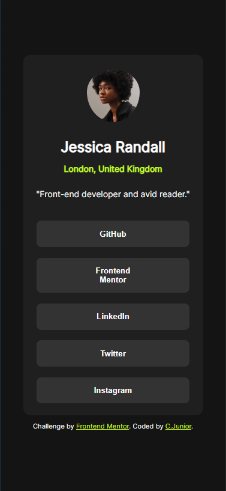
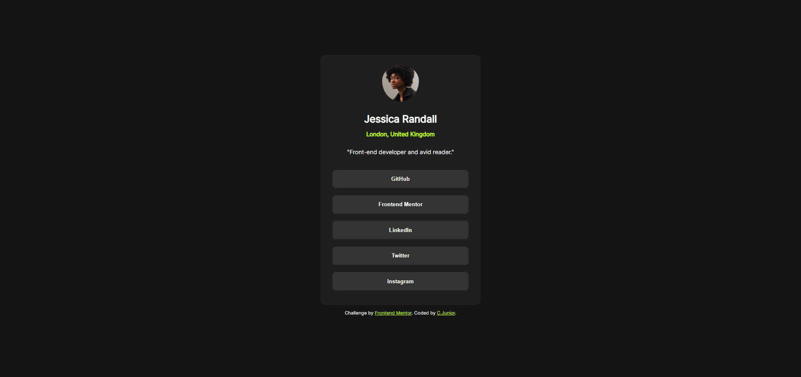

# Frontend Mentor - Social links profile solution / Links de perfil social

- Tradução simples: C.junior

This is a solution to the [Social links profile challenge on Frontend Mentor](https://www.frontendmentor.io/challenges/social-links-profile-UG32l9m6dQ). Frontend Mentor challenges help you improve your coding skills by building realistic projects.

Essa é uma solução ao desafio [Social links profile challenge on Frontend Mentor](https://www.frontendmentor.io/challenges/social-links-profile-UG32l9m6dQ). Desafios do Frontend Mentor ajudam a melhorar habilidades em codificação através da construção de projetos realistas.

## Table of contents / Indíce

- [Overview / Visão geral](#overview)
- [The challenge / O Desafio](#the-challenge)
- [Screenshot / Imagens do projeto](#screenshot)
- [Links](#links)
- [My process / Meu processo](#my-process)
- [Built with / Construído com](#built-with)
- [What I learned / O que aprendi](#what-i-learned)
- [Continued development / Desenvolvimento constínuo](#continued-development)
- [Useful resources / Recursos úteis](#useful-resources)
- [Author / Autor](#author)

## Overview

### The challenge

Users should be able to:

- See hover and focus states for all interactive elements on the page

Usários devem ser capaz de:

- Ver os estados hover e focus em todos os elementos interativos da página.

### Screenshot




### Links

- Solution URL / URL da solução: [Add solution URL here](https://your-solution-url.com)
- Live Site URL / URL do Site: [Add live site URL here](https://your-live-site-url.com)

## My process

### Built with

- Semantic HTML5 markup / HTML5 semântico
- CSS custom properties / propriedades CSS personalizadas
- Flexbox
- Mobile-first workflow
- Responsive design/ design responsivo
- Folder structure improve / estrutura de pastas melhorada

### What I learned

This project helped me solidify concepts such as: responsive design, flexbox, CSS rem unit, variables in CSS, first steps using semantic HTML and structuring folders in the project.

Esse projeto me ajudou a solidificar conceitos como: design responsivo, flexbox, unidade CSS rem, variáveis em CSS, primeiros passos usando HTML semântico e  estruturação de pastas no projeto.

```css
.proud-of-this-css {
    color: var(--violet-dark);
    @media screen and (with >= 375px){...}
}
```

### Continued development

- CSS @media screen
- Semantic HTML 5 markup
- CSS Grid

### Useful resources

- [Medium](https://madalinaeleonorag.medium.com/use-any-font-in-your-project-and-how-to-define-root-css-variables-28d9d05e276a)
- [Digital Ocean](https://www.digitalocean.com/community/tutorials/css-variable-fonts)
- [Stack Overflow](https://stackoverflow.com/questions/53846582/can-i-use-css-variables-in-a-font-list-and-have-it-work-in-legacy-browsers)
- These sites helped me improve css variable understanding / Esses sites me ajudaram a melhorar a compreensão das variáveis ​​CSS.

## Author

- Website - [C.Junior](https://clar-junior.github.io/social-links-profile-solution/)
- Frontend Mentor - [@Clar-Junior](https://www.frontendmentor.io/profile/yourusername)
